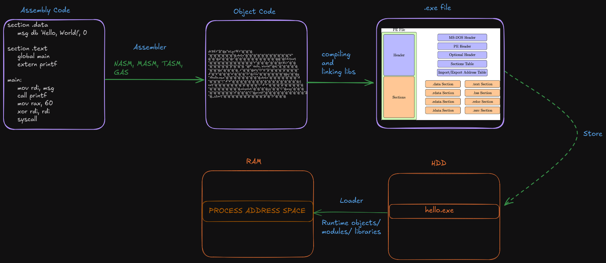

While using Windows OS, we often run programs using .exe files. But how can we create an .exe file, what is inside an .exe file and how does Windows run it?

  

In assembly code, we usually have `.data`, `.text`, and a `main` section. By using an assembler like NASM, we convert this assembly code into object code. Object code is a raw version of an executable file and is the machine language representation of the assembly code. Object code needs a linker to be converted into an executable file.

Object code contains opcodes and data that the processor needs to execute instructions. Here is an example of object code:

`b8 01 00 00 00 48 89 c7 48 89 fe 48 89 f2 48 89 d6 cd 80 b8 3c 00 00 00 31 ff cd 80`

The object code for the `mov rax, 1` instruction is `b8 01 00 00 00`.

- `b8` is the opcode for `mov rax, imm32`.
- `01 00 00 00` is the immediate value (1).

After linking with DLLs and other libraries, our object code (e.g., `.obj` or `.o` file) is turned into an `.exe` file. Executable files are in PE (Portable Executable) format. Below is a typical structure of a PE file:

### 1. Header:

- **DOS Header**: This part ensures compatibility with older MS-DOS systems and defines the starting address of the PE header.
- **PE Header**: This header specifies that the file is an executable with the `PE\0\0` signature. It contains information about the file, such as whether it is 32-bit or 64-bit.
    - **File Header**: This defines the file type, length, and processor information. It includes fields such as `NumberOfSections`, `TimeDateStamp`, `PointerToSymbolTable`, and `NumberOfSymbols`.
    - **Optional Header**: This header contains information about the stack and heap size, the entry point of the executable, and memory settings.
    - **Import/Export Tables**: These tables define the DLLs and functions that are imported or exported from the executable.

### 2. Sections:

- **.text**: This section contains the executable code of the program.
- **.data**: This section holds the program's globally defined variables, such as constants and global variables. This part is both writable and readable while the program is running.
- **.rdata**: This section contains read-only data such as constant text strings and functions imported from DLLs. This part is only readable.
- **.bss**: This section contains variables that are not initialized with a value. For example, an `int x;` variable.
- **.idata**: This section contains information for imported DLLs. For example, if the program requires functions from another DLL, this information is stored here. This part is generally readable and sometimes writable.
- **.reloc**: This section is used when the program is loaded into RAM. It defines changes in memory locations, allowing the program to be loaded at different memory addresses.
- **.rsrc**: This section is used for resources like icons, language strings, images, etc.
- **.debug**: This section contains additional information for debugging.

## Loading and executing Stage

An `.exe` file is stored on the HDD as a file. When a user wants to run it, the following steps occur:

1. The OS inspects all components of the file.
2. Using the information in the PE header, the OS determines which parts of the program will be loaded into which sections of memory. For example, the `.text` section is used for executable code.
3. The OS loads the appropriate sections into RAM and determines their addresses, base address, and other settings.
4. The loader starts the program using the entry point specified in the PE header.
